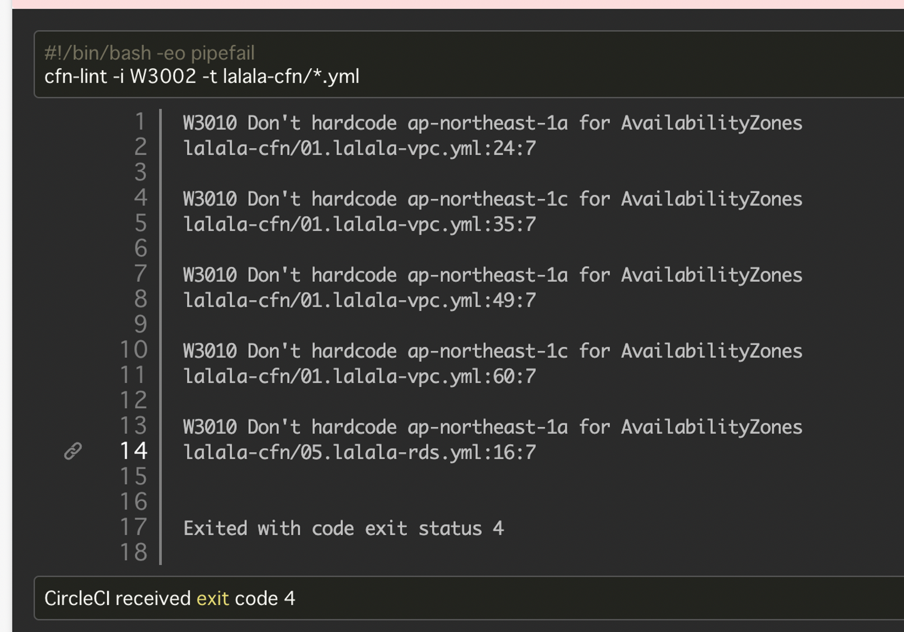
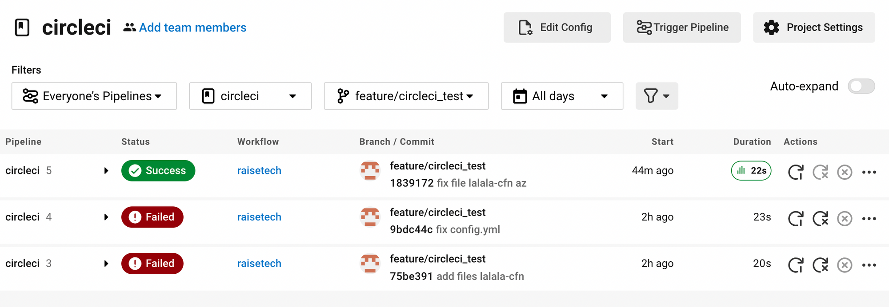

# CircleCI
- CircleCIのサンプルコンフィグをリポジトリに組み込み、正しく動作するか確認する。
## 実行したいこと
- プルリクエストを作成するとcfn-lintが自動的に実行され、Cloudformationテンプレートのテストを実行。

### CircleCIとGitHubのリモートリポジトリを連携し、ローカルリポジトリに .circleciディレクトリを作成
- ディレクトリ構成

```
.circleci
└── config.yml
lalala-cfn
├── 01.lalala-vpc.yml
├── 02.lalala-iam.yml
├── 03.lalala-ec2.yml
├── 04.lalala-elb.yml
├── 05.lalala-rds.yml
└── 06.lalala-s3.yml
README.md
```

### .circleci/config.ymlファイルにサンプルコードを記載

- サンプルコード

```
version: 2.1
orbs:
  python: circleci/python@2.0.3
jobs:
  cfn-lint:
    executor: python/default
    steps:
      - checkout
      - run: pip install cfn-lint
      - run:
          name: run cfn-lint
          command: |
            cfn-lint -i W3002 -t cloudformation/*.yml
  raisetech:
    jobs:
      - cfn-lint
```

### git pushしてCircleCIの動作を確認する
- config.ymlファイルをGitHubのリモートリポジトリにPush

失敗１
- ディレクトリを自分の環境に合わせて変更する必要があった。


```
cfn-lint -i W3002 -t lecture10/*.yml
　　　　　　　　　　　　　　　↓
cfn-lint -i W3002 -t lalala-cfn/*.yml
```

- 修正後の[config.yml](https://github.com/shino-taira/circleci/blob/main/.circleci/config.yml)ファイル

失敗２
- AZをハードコードしていたため失敗。[(参考)](https://chamimi.blog.jp/archives/15549977.html)


### テスト成功


